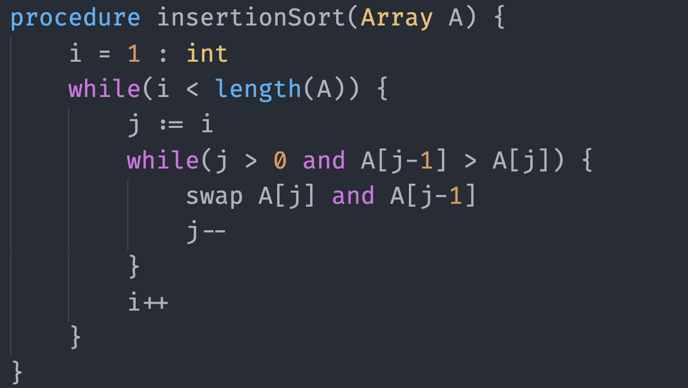
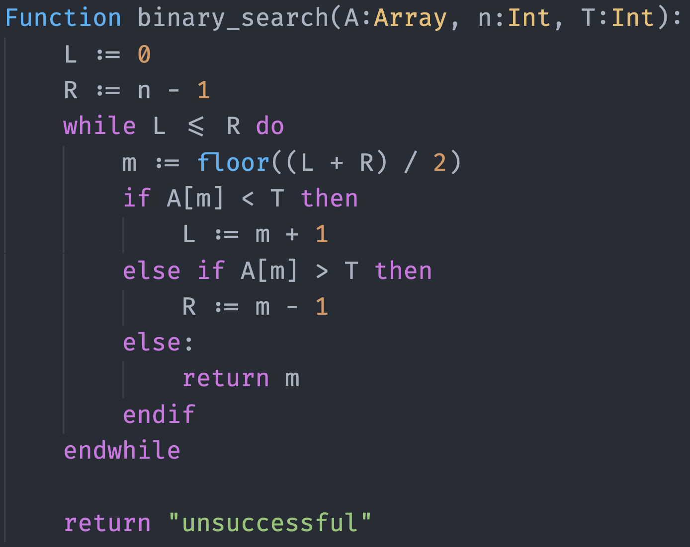
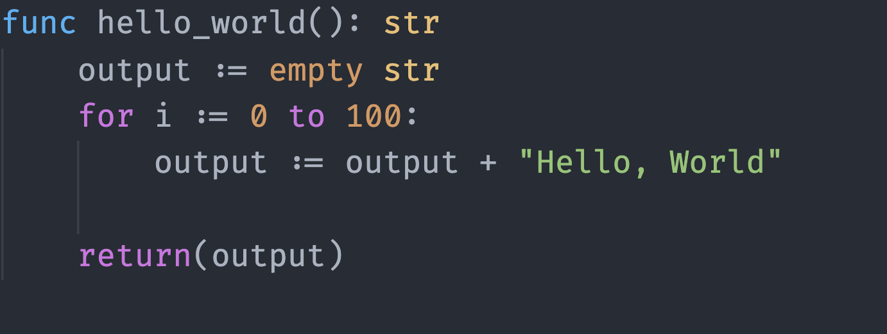

# pseudocode-language-support

A simple language support for all types of pseudocode.

## Features

- Multiple different styles of pseudocode supported
- Full syntax highlighting to make your code easier to work with and read
- Auto-completion and auto-indenting
- Standard functions (such as `print()`, `length()`) highlighted for ease of reading
- Supports pythonic, and C style pseudocode, as well as Textbook-based pseudocode.

Start editing a standard text file with a `.pseudo` extension to see the highlighting

## Known Issues

Not all language features added yet, feel free to request any that are currently missing

## Release Notes

### 1.0.0

Initial release of Pseudocode Language Support, with base features highlighting functions, constants, and common operators.

### 1.0.1

Added standard functions, types, and more keyword highlighting.

## Images

